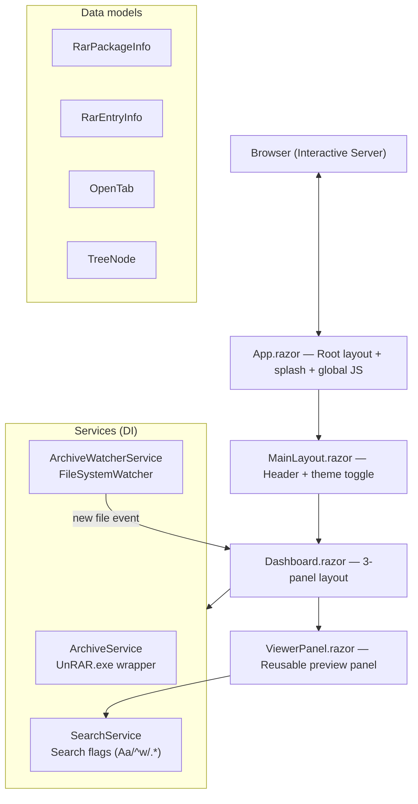
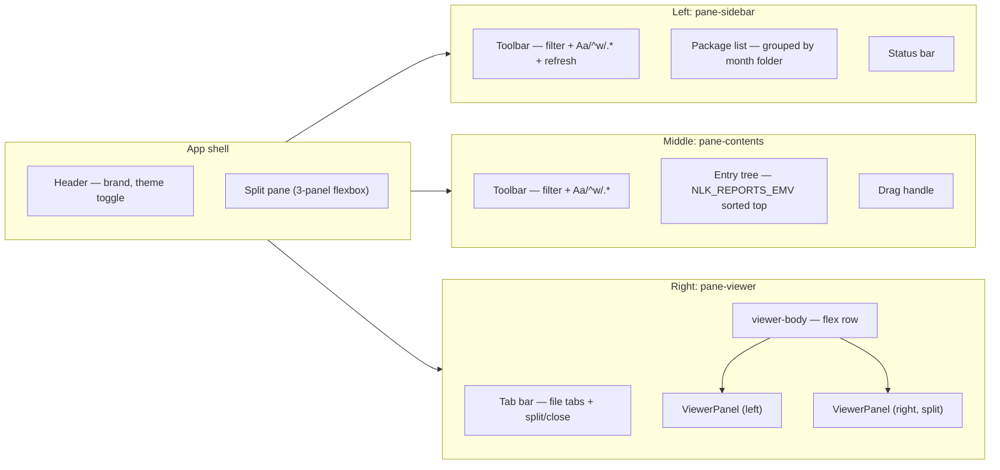
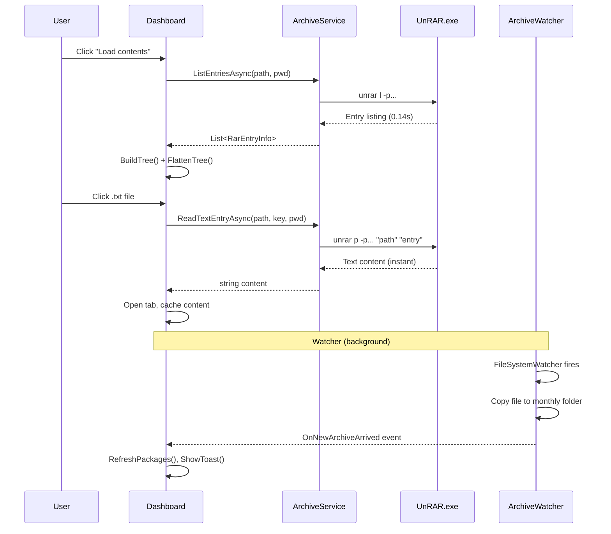

# NlkFtpReports

A Blazor Interactive Server application for browsing, searching, and previewing `.txt` files inside password-protected `.rar` archives. Designed for daily report workflows where archives arrive via FTP/SFTP and are organized by month.

---

## Architecture



---

## Panel layout



---

## Key features

| Feature | Detail |
|---|---|
| **Archive listing** | `UnRAR.exe l` — lists 900+ entries in ~0.14s |
| **Text preview** | `UnRAR.exe p` — streams single file content on demand |
| **File watcher** | Detects new `.rar` files in Downloads, copies to monthly folder |
| **Tabs** | Open multiple files side by side |
| **Split view** | Compare two files simultaneously |
| **Find in file** | Regex/whole-word/case-sensitive with row highlighting |
| **Auto-Zoom** | Adjusts font size when panels are collapsed (50% / 70% / 100%) |
| **Theme toggle** | Dark/light mode persisted to localStorage |
| **NLK_REPORTS_EMV pin** | Priority folder sorted to top of file tree |

---

## Project structure

```
NlkFtpReports/
├── Program.cs                        # Entry point, DI registration
├── appsettings.json                  # WatchDirectory + ArchivePassword
├── Components/
│   ├── App.razor                     # Root HTML, splash screen, global JS
│   ├── _Imports.razor                # Global usings
│   ├── Layout/
│   │   ├── MainLayout.razor          # Header + theme toggle
│   │   └── MainLayout.razor.css      # Scoped styles (mostly unused)
│   ├── Pages/
│   │   ├── Dashboard.razor           # 3-panel markup (~240 lines)
│   │   └── Dashboard.razor.cs        # Code-behind (~390 lines)
│   └── ViewerPanel.razor             # Reusable preview panel (~130 lines)
│   └── ViewerPanel.razor.cs          # Viewer find logic + OpenTab class
├── Services/
│   ├── IArchiveService.cs            # Interface + records
│   ├── ArchiveService.cs             # UnRAR.exe wrapper
│   ├── ArchiveWatcherService.cs      # FileSystemWatcher + Downloads scanner
│   └── SearchService.cs              # Shared search flags (Aa/^w/.*)
└── wwwroot/
    ├── css/app.css                   # All global styles (~1400 lines)
    ├── favicon.png
    └── nlkLogo.png
```

---

## Data flow



---

## Search across all bars

Three search bars share the same `SearchService` singleton:

| Location | Searches | Target |
|---|---|---|
| Sidebar toolbar | Package list | `FileName` + `RelativeDirectory` |
| Contents toolbar | File tree | `Path.GetFileName(entry.Key)` |
| Viewer find bar (per panel) | File content | Full text via JS regex |

Toggling Aa/^w/.* in any bar updates all three simultaneously via `SearchService.OnChanged` event.

---

## Architecture decisions

### Why UnRAR.exe instead of SharpCompress?
SharpCompress v0.38.0 hung indefinitely on these files. v0.49.1 took ~250ms per entry (40 entries = 10s). UnRAR.exe lists 984 entries in 0.14s. WinRAR is installed at `C:\Program Files\WinRAR\`.

### Why code-behind instead of all-in-one-file?
The original `Dashboard.razor` was 923 lines. Splitting into `.razor` (markup) + `.razor.cs` (C#) separates concerns. `ViewerPanel` eliminates the duplicated split-view block. `SearchService` centralizes toggle state instead of duplicating it across three search bars.

### Why singleton SearchService?
The Aa/^w/.* toggles should apply consistently across all search bars. A singleton service with an `OnChanged` event lets all consumers react when a toggle changes, without coupling them to each other.

### Why not extract everything into small components?
The app is feature-complete with a single main page. Over-extracting (PaneSidebar, PaneContents, TreeService) would add navigation overhead without tangible benefit. The current structure balances readability with minimal file count: 4 components + 4 services.

---

## Configuration

| Setting | Location | Default |
|---|---|---|
| `WatchDirectory` | `appsettings.json:NlkFtpSettings` | `C:\Users\Administrator\Desktop\NLK Reports 2026` |
| `ArchivePassword` | `appsettings.json:NlkFtpSettings` | `nlk01` |
| WinRAR path | `ArchiveService.cs:UnrarPath` | `C:\Program Files\WinRAR\UnRAR.exe` |
| Downloads path | `ArchiveWatcherService` | `C:\Users\{user}\Downloads` |

---

## Development

```bash
# Run
dotnet run --project NlkFtpReports

# Build
dotnet build NlkFtpReports
```
